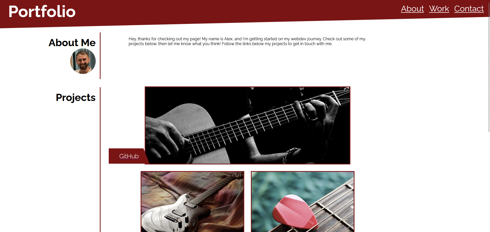

# Module 2: Advanced CSS

## TASK:
Build a responsive webpage that includes the following:
- sample of previous work
- my name, photo, nav links that navigate to proper sections of page
- contact information
- link to previous homework project with larger image than other images
- images are links to potential wesites
- responsive layout that adapts to screen size

---

[deployed webpage](https://x-is-for-alex.github.io/module-02-advanced-css/)

[project repo](https://github.com/X-is-For-Alex/module-02-advanced-css)

---

## Summary of work completed:
3/30/2023
AD
- created index.html and inserted content
- created style.css and made wireframe model of desired final layout
- pushed files to git
- added images
- adjusted styling that was out of alignment
- added responsive styling by using media queries
- refined and iterated final styling
- created readme.md
- tried to make sufficient git commits
- deployed final webpage to repo
- submitted project for review and grading

---

